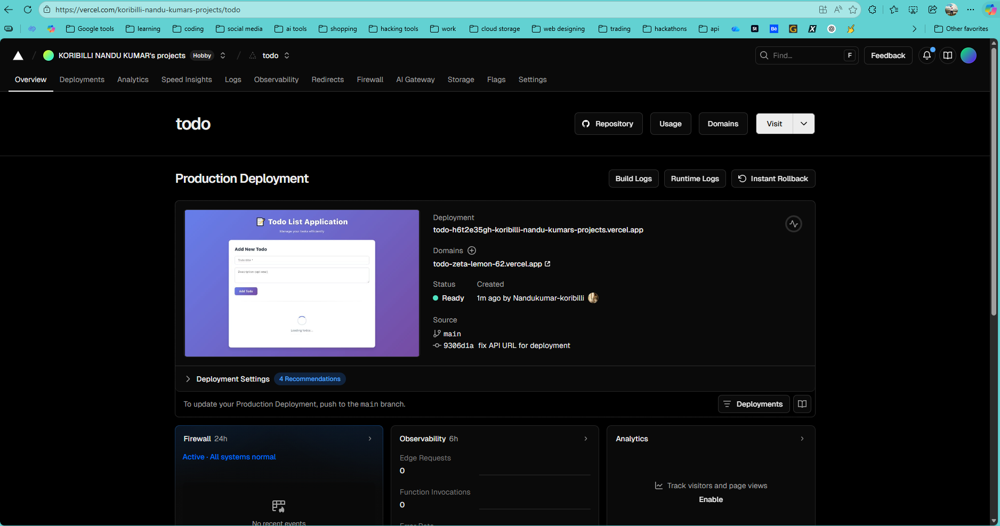

# Full Stack Todo Application

**Live Demo:** [https://full-stack-internship-assignment.vercel.app](https://full-stack-internship-assignment.vercel.app)

A robust CRUD (Create, Read, Update, Delete) application built with the MERN stack (MongoDB, Express.js, React, Node.js). This project demonstrates a complete full-stack workflow including frontend UI, backend API, database integration, and deployment.

## Features Implemented

This project successfully implements all the requirements:

- **[x] Frontend**: Built with **React** using functional components and hooks.

- **[x] Backend**: **Express.js** server with a RESTful API structure.

- **[x] Database**: **MongoDB** integration using **Mongoose** for data modeling.

- **[x] CRUD Operations**: Complete capability to Create, Read, Update, and Delete todo items.

- **[x] Deployment**: [https://full-stack-internship-assignment.vercel.app/](https://full-stack-internship-assignment.vercel.app/) Live deployment configured (Frontend on Vercel, Backend on Render/Heroku).

---

## Application Screenshots

### Web Interface

The user interface allows for easy management of tasks.


### Deployment Status

**Frontend (Vercel)**


**Backend (Render/Heroku)**


---

## Getting Started

Follow these instructions to get a copy of the project up and running on your local machine.

### Prerequisites

- Node.js (v14 or higher)
- MongoDB (Local or Atlas URI)

### 1. Installation

**Clone the repository**

```bash
git clone <your-repo-url>
cd "task-1-TODO_CRUD"
```

**Step A: Server Setup**
Navigate to the server directory and install dependencies.

```bash
cd server
npm install
```

The `.env` file is NOT included in the repository for security. Please download the `.env` file shared in the submission email, place it in the `server` directory, and verify it contains:

```env
MONGODB_URI=...
PORT=5000
```

**Step B: Client Setup**
Open a new terminal, navigate to the client directory and install dependencies.

```bash
cd ../client
npm install
```

### 2. Running the Application

You need to run both the backend and frontend servers.

**Start the Backend Server**
In your server terminal:

```bash
npm start
# Output: Server running on port 5000... MongoDB connected successfully...
```

**Start the Frontend Development Server**
In your client terminal:

```bash
npm run dev
```

The application will open at `http://localhost:5173` (or the port shown in your terminal).

---

## Tech Stack

- **Frontend**: React, Vite, CSS3
- **Backend**: Node.js, Express.js
- **Database**: MongoDB, Mongoose
- **Tools**: Git, npm

**Good luck with your interview! 🎯**
