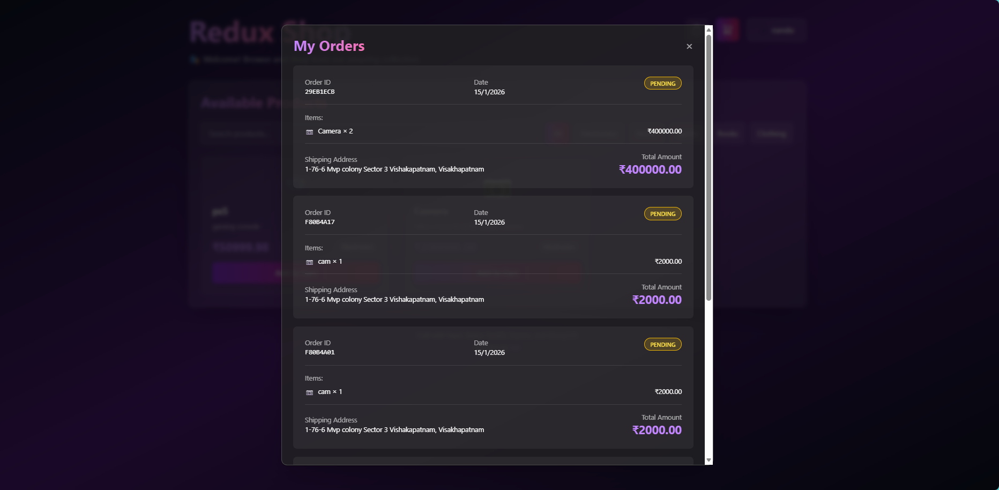

# Redux Shopping Application - Full-Stack E-Commerce Platform


A complete, production-ready e-commerce application demonstrating Redux state management, authentication, role-based access control, and full-stack development with React, Redux Toolkit, Express.js, and MongoDB.

## ✅ Task 4: State Management Implementation Status

This project successfully implements all specific requirements for Task 4:

- [x] **Setup**: Installed `redux`, `react-redux`, and `@reduxjs/toolkit`.
- [x] **Store**: Created a central Redux store to hold the application's state (`src/store/store.js`).
- [x] **Actions and Reducers**: Defined actions and reducers using Redux Toolkit slices (Auth, Cart, Products, User).
- [x] **Integration**: Connected React components to the Redux store using `Provider`, `useSelector`, and `useDispatch`.

---

## 🚀 Quick Start Guide

### Prerequisites

- Node.js (v14+)
- MongoDB (Atlas or Local)

### Installation & Running

**1. Clone and Install Dependencies**

```bash
# Frontend
npm install

# Backend
cd server
npm install
cd ..
```

**2. Setup Environment**
The `.env` file is not included for security. Please place the `.env` file from the submission email into the `server/` directory. Check `server/.env` to ensure it matches your configuration.

**3. Run the Application**
Open **two** terminal windows:

**Terminal 1 (Backend):**

```bash
cd server
npm start
```

_Server runs on: http://localhost:5000_

**Terminal 2 (Frontend):**

```bash
npm run dev
```

_App runs on: http://localhost:5173_

---

## ✨ Project Screenshots & Features

### 1. Authentication & Security

Secure login and registration with JWT tokens and password hashing.


### 2. User Dashboard & Store

Users can browse products, filter by category, and manage their profile.


### 3. Shopping Cart & Orders

Full cart management with Redux. Users can add items, update quantities, and place orders.


Users can view their order history and status.


### 4. Admin Dashboard

Admins have exclusive access to manage the product inventory.


### 5. User Profile Management

Users can update their personal details and shipping information.


---

## 🛠️ Tech Stack

**Frontend:** React , Redux Toolkit, Tailwind CSS, Vite
**Backend:** Node.js, Express.js, JWT, Bcrypt
**Database:** MongoDB


## 📁 Key Directories

```
task-4_Redux/
├── src/
│   ├── store/              # 🔄 Redux State Management
│   │   ├── store.js       # Store configuration
│   │   ├── authSlice.js   # Authentication state
│   │   ├── cartSlice.js   # Cart management
│   │   └── productsSlice.js # Product catalog
│   └── components/        # ⚛️ React Components
├── server/
│   ├── routes/           # 🛣️ API Routes
│   └── models/           # 📦 Database Models
└── images/               # 📸 Project Screenshots
```

## 🎨 Redux Implementation Details

### Store Configuration

The store combines multiple slices to manage different aspects of the application state.

```javascript
export const store = configureStore({
  reducer: {
    auth: authReducer,
    user: userReducer,
    products: productsReducer,
    cart: cartReducer,
  },
});
```

### Example: Shopping Cart Slice

Managing complex state logic like adding/removing items and updating totals.

```javascript
const cartSlice = createSlice({
  name: "cart",
  initialState,
  reducers: {
    addToCart: (state, action) => {
      const existingItem = state.items.find(
        (item) => item.id === action.payload.id
      );
      if (existingItem) {
        existingItem.quantity += 1;
      } else {
        state.items.push({ ...action.payload, quantity: 1 });
      }
    },
    // ... other reducers
  },
});
```

## 🎓 Learning Outcomes

1. **Redux Toolkit Mastery**: `createSlice`, `configureStore`, `createAsyncThunk`.
2. **Full-Stack Integration**: Connecting React frontend with Express/MongoDB backend.
3. **Authentication Flow**: Handling JWT tokens in Redux state and HTTP headers.
4. **Responsive Design**: Building modern UIs with Tailwind CSS.

---

**Built for the Full-Stack Internship Assignment**
